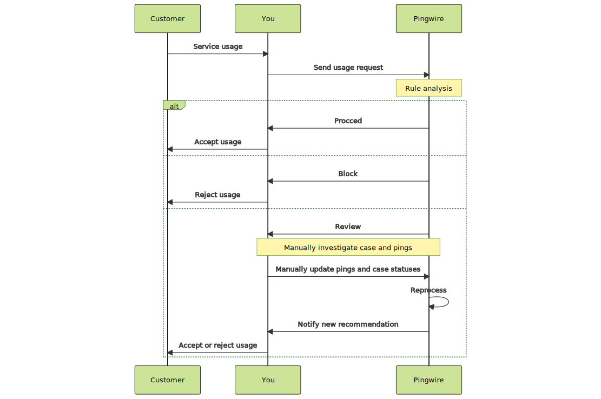
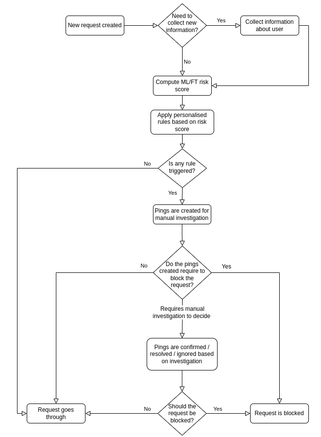

The Pingwire API can be used by companies in active collaboration with Pingwire AB.

 <a href="mailto:sales@pingwire.io">Become a partner</a>

# Introduction
For making the integration to Pingwire as seamless as possible, we have included a section `Introduction` that explains keywords and illustrates the processes.

## Dictionary

- `ENTITY`: An entity is a subject for investigation e.g an individual, a company, or an asset. 
- `REQUEST`: A request is an enquiry to the system by the user to investigate one or several entities. Initiated manually or through API. 
- `RULE`: Each request triggers a set of user defined rules. Rules can also executed at regular intervals by the system for continuous monitoring.
- `PING`: For each rule broken the system creates a Ping. The Ping identifies a unit of suspicious information that needs to be followed up. A Ping is Confirmed, Resolved or Ignored: by the user.

- `CASE`: Provides the main user interface. A Case collects sets of Pings and related Entities and provides means to investigate and report suspicious activities in bulk.
- `SEGMENT`: Custom grouping corresponding to a self-defined group structure, e.g. product usage. In addition, segments also correspond to a baseline probability of criminal activity.
- `RISK CLASS`: Classes partitioned by the probability of an entity committing a crime using self-defined probability intervals.

## Sequence Diagram

## Request flowchart
The following flowchart illustrates a typical request process.

# Test objects

The following test objects can be used to test different request API responses from the Pingwire system. If a request contains any of the following objects at any request role, .e.g. initiator, of any request type, .e.g. transaction, the request will be triggered by a test rule. 

|   | Environment | Identification | Entity type  | Recommendation | Create ping |
|---|------------|--------------------------------|--------------|----------------|-------------|
| 1 |   staging  |          SSN -> 201912072392          |  Individual  |      block     |     true    |
| 2 |   staging  |          SSN -> 201912302385          |  Individual  |     review     |     true    |
| 3 |   staging  |          Org. nr. -> 5599887766          |  Business  |      block     |     true    |
| 4 |   staging  |          Org. nr. -> 5566778899          |  Business  |     review     |     true    |
| 5 |   staging  |          Reg. nr. -> AAA111          |  Car  |      block     |     true    |
| 6 |   staging  |          Reg. nr. -> ABC123          |  Car  |     review     |     true    |